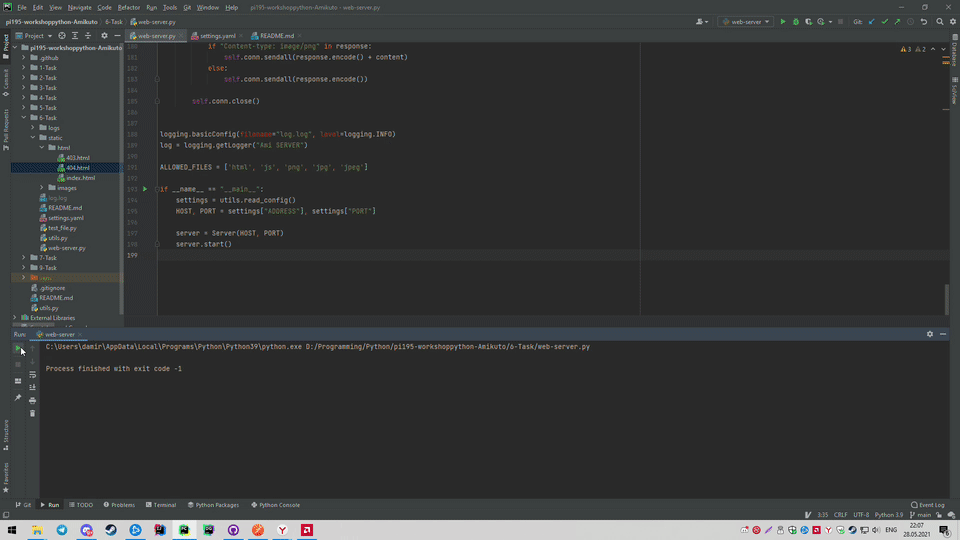

# index.html, 404.html, 403.html и отправка картинки через сокет


## Низкоуровневая работа с веб

### Цель работы

Освоить основные навыки обращения c Web из программы на Python, средства парсинга веб-страниц, соответствующие библиотеки.

### Задания для выполнения


1. Написать простейший веб-сервер. Сервер должен принимать входящие соединения на порту 80 и отдавать пользователю содержимое запрошенного ресурса из определенной директории (рабочей директории сервера).
2. Разместите в рабочей директории сервера простой веб сайт, содержащий страницу index.html. Убедитесь, что при подключении к серверу, если не указан необходимый ресурс он отдает содержимое страницы index.html.
3. Познакомьтесь со спецификацией протокола HTTP. Узнайте, в каком формате клиент посылает запрос серверу и в каком формате сервер посылает ответ клиенту. Особое внимание уделите полям заголовка.
4. Сделайте так, чтобы к вашему серверу можно было обращаться по протоколу HTTP. Для этого не нужно реализовывать поддержку всех возможных нюансов, вам нужно лишь описать общий формат запросов и ответов и поддерживать некоторые поля заголовков.
5. Проверьте работу вашего сервера, обратившись к нему из адресной строки любого браузера. Для этого достаточно написать в ней адрес хоста, на котором работает сервер (localhost тоже подходит). Вы должны увидеть содержимое (не код) вашей страницы. 

### Методические указания

Веб-сервер - это сложный программный комплекс, реализующий огромный набор функций и поддерживающий все нюансы современных версий протокола HTTP. В данной работе мы постараемся реализовать самый минимум функций для того, чтобы программу, которую мы написали, можно было называть веб-сервером.

Для начала, нам нужно создать папку, которую мы назначим рабочей директорией веб-сервера. Для этих целей вы можете использовать каталог в вашей домашней папке. Давайте создадим там два текстовых файла. Один с именем 1.html, второй - 2.html. Они нам понадобятся для отработки запросов к разным файлам.

```html
<!-- 1.html --> 
<H1> Первый файл </H1>
<!-- 2.html --> 
<H1> Второй файл </H1>
```

Для того, чтобы создать простейший веб-сервер, на самом деле много не нужно. Начнем с написания простого приложения, которое прослушивает определенный порт. Веб-сервера по умолчанию используют порт 80. Вы можете использовать любой другой, чтобы не запускать его с повышенными привилегиями.

```
import socket
sock = socket.socket()
try:
  sock.bind(('', 80))
except OSError:
  sock.bind(('', 8080))
sock.listen(5)
conn, addr = sock.accept()
print("Connected", addr)
conn.close()
```python

Сессия HTTP состоит из запроса клиента и ответа сервера. Запустив наш сервер, мы можем попробовать подключиться к нему из браузера. Запустим браузер и наберем в адресной строке адрес хоста и номер порта в таком виде: “localhost:8080”. Мы должны увидеть, что сервер напечатал сообщение о подключении.

Теперь давайте посмотрим, что браузер отправляет в сокет:

```python
conn, addr = sock.accept()
print("Connected", addr)
data = conn.recv(8192)
msg = data.decode()
print(msg)
```

Обратите внимание, что мы читаем из сокета 8 КБ информации. Это стандартный максимальный объем простого запроса. Имейте в виду, что HTTP запросы бывают разных видов. Мы рассматриваем только самый простой и основной - GET. Он используется браузерами для получения страниц. При подключении браузера мы должны увидеть что-то такое:

```
Connected ('127.0.0.1', 49187)
GET / HTTP/1.1
Host: localhost:8080
Connection: keep-alive
Cache-Control: max-age=0
Upgrade-Insecure-Requests: 1
User-Agent: Mozilla/5.0 (Windows NT 10.0; Win64; x64) AppleWebKit/537.36 (KHTML, like Gecko) Chrome/77.0.3865.120 Safari/537.36
Sec-Fetch-Mode: navigate
Accept: text/html,application/xhtml+xml,application/xml;q=0.9,image/webp,image/apng,*/*;q=0.8,application/signed-exchange;v=b3
Sec-Fetch-Site: cross-site
Accept-Encoding: gzip, deflate, br
Accept-Language: ru-RU,ru;q=0.9,en-US;q=0.8,en;q=0.7
```

Познакомьтесь со структурой запроса. Здесь важна первая строчка - это статусная строка. В ней указывается метод запроса (GET), имя запрашиваемого ресурса (/, то есть корень) и версия протокола. 

Затем идут поля заголовка, которые несут дополнительную служебную информацию о браузере, пожеланиях по принимаемым типам и так далее. Почти все эти поля являются необязательными.

Важна и последняя строка. Она пустая. Эта строка отделяет заголовок запроса от тела. В данном случае, у запроса по методу GET тела нет. Но у ответа сервера тело чаще всего есть.

Давайте отправим простейший ответ. Если мы просто напишем в сокет строку, браузер ее не отобразит, так как сочтет невалидным. Для того, чтобы браузер нас понял нужно послать статусную строку ответа, затем пустую строчку и тело ответа. В теле ответа передается непосредственно файл, который отображается в браузере. Давайте пошлем Hello, webworld!

```python
## data = conn.recv(8192)
msg = data.decode()
print(msg)
resp = """HTTP/1.1 200 OK
Hello, webworld!"""
conn.send(resp.encode())
conn.close()
```

Обратите внимание на пустую строку между статусной строкой и телом ответа. Она обязательна. В данном случае, мы не посылаем никакие поля, однако для более серьезной работы нужно отправлять самые важные.

Самостоятельно реализуйте разбор запроса клиента и отправку запрашиваемого файла. Проверьте корректность работы с поддиректориями. Также, не забудьте сделать ваш сервер многоразовым и многопоточным.


### Дополнительные задания


1. При ответе вашего сервера посылайте некоторые основные заголовки:
    1. Date
    2. Content-type
    3. Server
    4. Content-length
    5. Connection: close.
2. Создайте файл настроек вашего веб-сервера, в котором можно задать прослушиваемый порт, рабочую директорию, максимальный объем запроса в байтах. Можете добавить собственные настройки по желанию.
3. Если файл не найден, сервер передает в сокет специальный код ошибки - 404.
4. Сервер должен работать в многопоточном режиме.
5. Сервер должен вести логи в следующем формате: Дата запроса. IP-адрес клиента, имя запрошенного файла, код ошибки.
6. Добавьте возможность запрашивать только определенные типы файлов (.html, .css, .js и так далее). При запросе неразрешенного типа, верните ошибку 403.
7. Реализуйте поддержку постоянного соединения с несколькими запросами.
8. Реализуйте поддержку бинарных типов данных, в частночти, картинок.

<!-- Docs to Markdown version 1.0β17 -->
